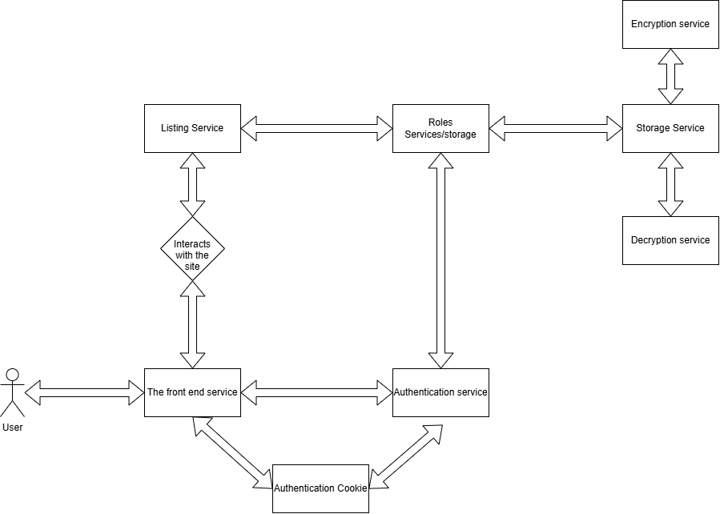

# The Architecture

The user interracts with the app with the front end page that is provided by the front-end service. The front-end service handles all the parts that the user interacts with directly, such as the login page, item listing page and encrypting page. 

From the front-end service the user logs in or registers, these actions are handled by the authentication service. The authentication service gives the user the correct and necessary access cookies to interact with the site.

The storage and roles service communicates with with the authentication service to provide all of the correct encrypted files. From there those files could be either listed, added and encrypted or fetched and decrypted.

## Planned authentication and session model

Authentication will use Keycloak locally through OpenID Connect. The frontend will use the authorization-code flow with PKCE, while the backend will act as the trusted session boundary. Browser JavaScript will not receive or store access tokens. After successful authentication, the backend will create a server-side session containing the user ID, roles, creation time, last activity time, and an expiration time, then return only a random opaque session identifier in a cookie. The session identifier will be at least 256 bits of cryptographically secure randomness and only a hash of it will be stored by the backend.

The session cookie will use `Secure`, `HttpOnly`, and `SameSite=Lax` flags, with `Path=/` and no broad `Domain` attribute. The application will run over local HTTPS so the `Secure` flag is always enabled. State-changing requests will also use CSRF protection. Sessions will expire after 30 minutes of inactivity and after 8 hours absolutely, with explicit logout revoking the server-side session and logging the user out of the identity provider where appropriate. Sensitive operations such as changing account security settings will require recent authentication.

Session fixation will be prevented by rejecting client-supplied session IDs, creating a new session after login, rotating the session ID after authentication and privilege changes, and invalidating any pre-authentication session. Logout, password changes, account disablement, and suspected compromise will revoke all relevant sessions. Authorization will be checked by the backend on every request; roles or permissions supplied by the frontend will never be trusted.

## The OWASP threat model

The application should treat the frontend as untrusted. Authentication, authorization, validation, and security decisions must be enforced by backend services rather than by browser code or values supplied by the client. 

### [A01:2025 - Broken Access Control](https://top10.owasp.org/2025/A01_2025-Broken_Access_Control/)

**Threat:** An attacker changes a file ID, username, role, or API request in the browser and reads, downloads, modifies, or deletes another user's encrypted files. A client-side role check can also be bypassed by calling the API directly.

**Intended mitigation:** Enforce authorization on every server-side request using the authenticated identity and a server-side ownership or role check. Deny access by default, use least privilege, avoid trusting client-supplied roles and IDs.

### [A02:2025 - Security Misconfiguration](https://top10.owasp.org/2025/A02_2025-Security_Misconfiguration/)

**Threat:** Debug endpoints, verbose errors, default credentials, permissive CORS, missing security headers, exposed service ports, or development settings reveal data or enable unauthorized access.

**Intended mitigation:** Use hardened production configuration, remove unused features and default account credentials, restrict CORS to trusted origins within the backend services, return generic error messages, keep services on private networks in the backend.

### [A03:2025 - Software Supply Chain Failures](https://top10.owasp.org/2025/A03_2025-Software_Supply_Chain_Failures/)

**Threat:** A vulnerable frontend package, backend framework, encryption library, container image, or operating-system dependency is exploited to compromise the application or its data.

**Intended mitigation:** Maintain an inventory and lock files, review dependency advisories, update and patch dependencies regularly, remove unused packages, scan dependencies and images in CI.

### [A04:2025 - Cryptographic Failures](https://top10.owasp.org/2025/A04_2025-Cryptographic_Failures/)

**Threat:** Encrypted files, passwords, keys, cookies, or sensitive data are exposed through weak algorithms, hard-coded keys, plaintext storage, logs, or an insecure transport connection.

**Intended mitigation:** Use well-tested, authenticated encryption with managed keys, never hard-code secrets, hash passwords with a modern adaptive password-hashing algorithm, use HTTPS everywhere, protect cookies with `Secure`, `HttpOnly` and keep plaintext keys and sensitive values out of logs.

### [A05:2025 - Injection](https://top10.owasp.org/2025/A05_2025-Injection/)

**Threat:** User-controlled filenames, metadata, search terms, or account data are interpreted as HTML, JavaScript, SQL, shell commands, or another executable language. This includes stored or reflected XSS, HTML/JavaScript injection, and SSRF when the server fetches a user-supplied URL.

**Intended mitigation:** Validate input, use parameterized queries and safe APIs, encode output for its context, render untrusted text as text rather than HTML, avoid dangerous browser sinks such as `innerHTML` and `eval`.

### [A06:2025 - Insecure Design](https://top10.owasp.org/2025/A06_2025-Insecure_Design/)

**Threat:** The design assumes that hiding buttons or checking permissions in JavaScript is sufficient, or it lacks a clear trust boundary between the frontend, authentication service, and storage service.

**Intended mitigation:** Define strong boundries and apply proper authentication and boundries for the necessary parts.

### [A07:2025 - Authentication Failures](https://top10.owasp.org/2025/A07_2025-Authentication_Failures/)

**Threat:** Weak passwords, credential stuffing, predictable session tokens, insecure password-reset links, session fixation, or missing logout and session expiration allow account takeover.

**Intended mitigation:** Use a proven authentication library, enforce strong passwords and rate limiting, protect login and reset flows against enumeration, rotate the session after login, expire and revoke sessions, and require multi-factor authentication for sensitive operations where appropriate.

### [A08:2025 - Software or Data Integrity Failures](https://top10.owasp.org/2025/A08_2025-Software_or_Data_Integrity_Failures/)

**Threat:** Unsigned updates, compromised dependencies, insecure CI/CD, or trusting client-supplied serialized data allows malicious code or modified file metadata to enter the system. Input tampering can change an operation, file ownership, or security decision.

**Intended mitigation:** Validate and authorize every request on the server, use integrity-protected tokens and data formats, sign and verify releases where appropriate, protect the build pipeline and secrets, pin and verify dependencies, and reject modified or unexpected fields rather than silently trusting them. Create and safely store file hashes independently from the files

### [A09:2025 - Security Logging and Alerting Failures](https://top10.owasp.org/2025/A09_2025-Security_Logging_and_Alerting_Failures/)

**Threat:** Failed logins, authorization failures, file downloads, key events, and suspicious input tampering are not recorded, or logs contain passwords, tokens, or plaintext file contents. An attack then goes undetected.

**Intended mitigation:** Log security-relevant events with user, action, resource, timestamp, and outcome while excluding secrets and sensitive content. Centralize and protect logs, alert on repeated failures and privilege violations, retain logs according to policy, and test that alerts are generated.

### [A10:2025 - Mishandling of Exceptional Conditions](https://top10.owasp.org/2025/A10_2025-Mishandling_of_Exceptional_Conditions/)

**Threat:** Unexpected errors, timeouts, malformed files, failed encryption operations, or partial database writes leave the application in an insecure state or expose stack traces and sensitive data. Fail-open behavior can also grant access when an authorization or validation check fails.

**Intended mitigation:** Handle errors explicitly and fail closed, use transactions for related file and permission changes, validate all external responses, return generic error messages, clean up temporary plaintext and partial files, apply bounded timeouts and resource limits, and test failure paths including authorization-service and storage-service outages.

## The Technology Stack

The application will use a Go backend, a React frontend written in TypeScript, PostgreSQL for structured data, MinIO for encrypted file storage, and Keycloak for local authentication. Every component will run locally in Docker containers, with Docker Compose for simple development and Kubernetes through Minikube or kind for orchestration testing. Go was chosen because it is simple, statically typed, memory-safe, efficient, and well suited to secure APIs. TypeScript improves frontend reliability, PostgreSQL provides dependable transactions and access control, MinIO offers local S3-compatible storage, and Keycloak provides a realistic local identity service without relying on external cloud infrastructure. This setup allows the entire application to be developed, tested, and deployed locally while still demonstrating container isolation, Kubernetes security controls, TLS, network policies, resource limits, and managed secrets.

## Running Locally
Still work in progress, but will definetly run locally on containers
